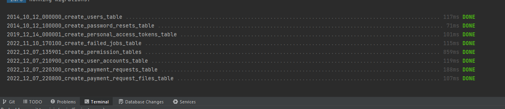
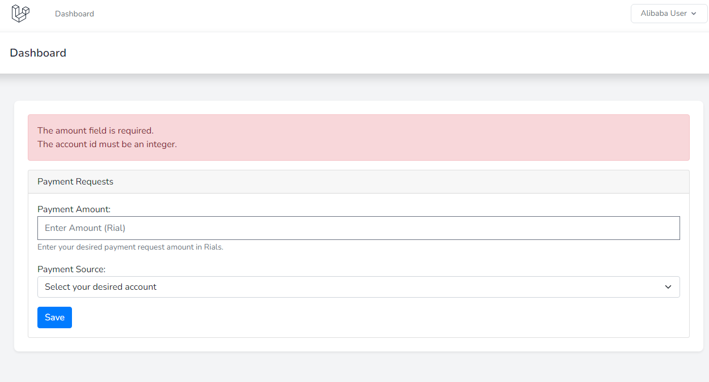
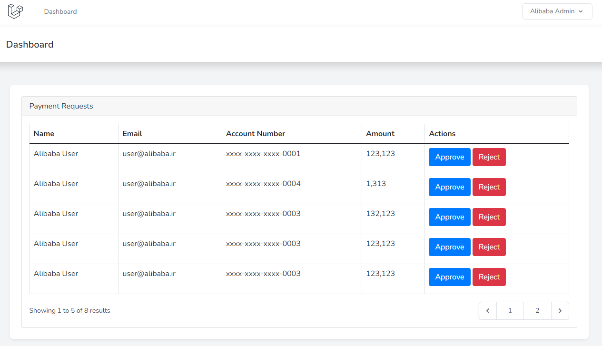

## AliBaBa Task: A simple blade dashboard with user permission

A simple web application with different user levels, simple blade files, and chunk upload to upload large pdfs, using
database transactions (commit/rollback).

## Author

- name: Ali Jomehri
- phone: 09352770177
- mail: ajomehri@gmail.com

## What's included:

- [x] PHP 8.1
- [x] Production Readiness (Dockerized)
- [x] Strategy design pattern
- [x] Using Laravel service container, binding of services
- [x] Authentication & user permission

## Installation:

- [install docker](https://docs.docker.com/get-docker/) based on your system environment
- cd project folder
- cd docker
- `docker-compose up`
- cd ../src
- `cp .env.example .env`
- `composer install`
- make sure you have last version of npm installed and run `npm install`
- to build the required resources run `npm run build`
- Grant required permissions: `sudo chmod 777 storage/ -R`
- cd ../docker
- Database Migrations(Raw mysql statements): `sudo docker-compose exec alb-php-web php artisan migrate:fresh --seed`

## Demo

- Login with `user@alibaba.ir` and password `123456` and add a few payment requests
- Login with `admin@alibaba.ir` and password `123456` to approve/reject requests

## Screenshots
- 
- 
- 
